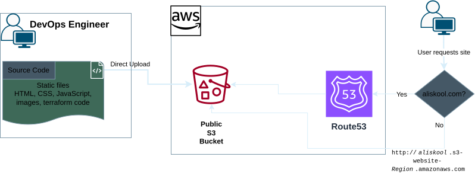
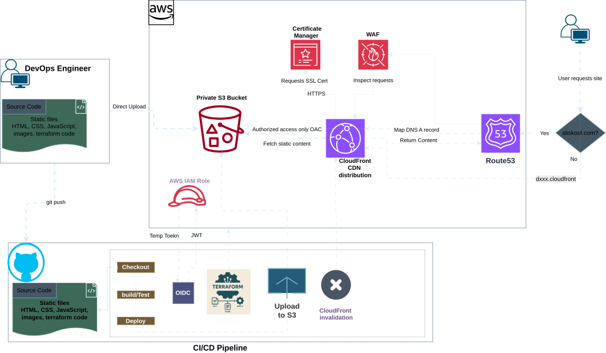

# Cloud Launchpad

A hands-on cloud and platform engineering project focused on deploying, securing, and automating a static website on AWS.

## AWS Architecture

The production deployment uses a private S3 bucket as the origin, CloudFront as the public entry point, and GitHub Actions CICD to automate deployments.


## Live Homepage

The site itself is intentionally simple so the focus stays on the AWS infrastructure, deployment workflow, and platform engineering concepts behind it.


**Follow the course → [https://s3.aliskool.com/](https://s3.aliskool.com/)**

---

## Why AWS for a static site?

A static site does not need AWS.

This exact site can be published in minutes with GitHub Pages, Cloudflare Pages, Netlify or Vercel and the `main` branch is deliberately deployed to GitHub Pages to prove it.

**[View the simple GitHub Pages deployment →](https://gcodiac.github.io/aws-s3-static-site-cicd/)**

The AWS version exists for a different reason: to use a simple application as the vehicle for learning the infrastructure around it.

That means working with:

- private S3 origins
- CloudFront and edge caching
- IAM and least privilege
- TLS certificates
- Terraform
- GitHub Actions
- OIDC-based AWS authentication
- deployment verification

Keeping the application static removes backend complexity, so the focus stays on infrastructure, delivery and automation.

**[Follow the course →](https://s3.aliskool.com/)**

---

## What you'll learn

Three stages, each with its own branch. The same site is hosted a little more professionally every time.

### Stage 1: Deploy straight to S3 ([`1-aws-cli-deploy`](../../tree/1-aws-cli-deploy))

Create a public S3 bucket, turn on static website hosting, and upload the files with one
`aws s3 sync`. No Terraform, no pipeline.



### Stage 2: Terraform, run locally ([`2-terraform-start`](../../tree/2-terraform-start) and [`3-terraform-end`](../../tree/3-terraform-end))

The same hosting, declared as code and applied from your machine. Build it yourself, then compare.

- Start here: [`2-terraform-start`](../../tree/2-terraform-start), the site with no Terraform. You write it.
- Finished version: [`3-terraform-end`](../../tree/3-terraform-end), the completed Terraform.


### Stage 3: CI/CD with GitHub Actions ([`6-cicd-start`](../../tree/6-cicd-start) and [`7-cicd-end`](../../tree/7-cicd-end))

A private S3 bucket behind CloudFront, deployed by GitHub Actions. A push to `main` applies the
Terraform, uploads the site and clears the cache, signing in to AWS with OIDC so no keys are stored.

- Start here: [`6-cicd-start`](../../tree/6-cicd-start), the CloudFront setup with no pipeline. You build it.
- Finished version: [`7-cicd-end`](../../tree/7-cicd-end), the completed pipeline. This branch contains it too: see `infra/` and `.github/workflows/deploy.yml`.
- Builds on: [`4-cloudfront-start`](../../tree/4-cloudfront-start) and [`5-cloudfront-end`](../../tree/5-cloudfront-end), the S3 and CloudFront stage.



The full production reference is on [`platform-engineering`](../../tree/platform-engineering).

---

## Run locally

```bash
git clone git@github.com:gcodiac/aws-s3-static-site-cicd.git
cd aws-s3-static-site-cicd

make serve    # http://localhost:8080
```

Or open the folder in VS Code and use the **Live Server** extension.

---

## Course

**[Open the Platform Engineering Course →](https://s3.aliskool.com/)**

Step-by-step lessons on S3, CloudFront, ACM, Terraform, GitHub Actions and OIDC, built
around this exact project.

---

## Cost considerations

| Component | Cost consideration |
| --- | --- |
| GitHub Pages | Free for this demo |
| S3 | Very low for a small static site; storage + requests |
| CloudFront | Usage-based requests/data transfer |
| ACM | No separate charge for public certs used with supported AWS services |
| Route 53 | Optional hosted-zone/domain cost |
| CI/CD | GitHub Actions usage depends on plan/runtime |

For a small training site the AWS cost should be low, but resources should still be
destroyed when no longer needed.

---

## Licence

MIT. See [LICENSE](LICENSE).
